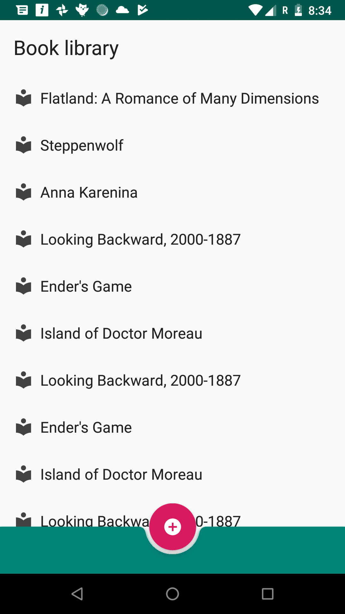
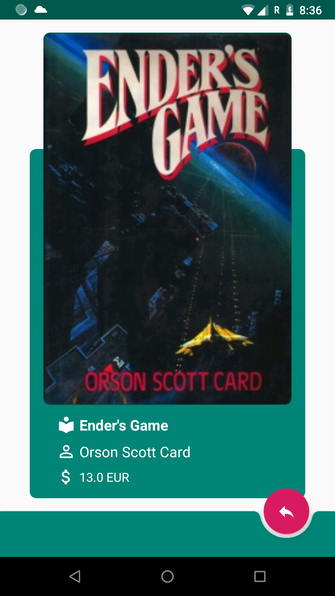

# \[ 🚧 Work in progress 👷‍♀️⛏👷🔧️👷🔧 🚧 \] BookLibrary
# Android Book Library

*Book Library Presention Project*

*Android Book Library* is a showcase of [MVVM](https://en.wikipedia.org/wiki/Model%E2%80%93view%E2%80%93viewmodel) with [Android Architecture Components](https://developer.android.com/topic/libraries/architecture/), [Navigation Components](https://developer.android.com/topic/libraries/architecture/navigation/), [AndroidX](https://developer.android.com/topic/libraries/support-library/androidx-overview), [JetPack](https://developer.android.com/jetpack/) and much more.

Framework lays great emphasis on flexibility in deciding how to organize and architect an Android app. You can use the project for learning or as a starting point for creating your own apps.

### Screenshots

